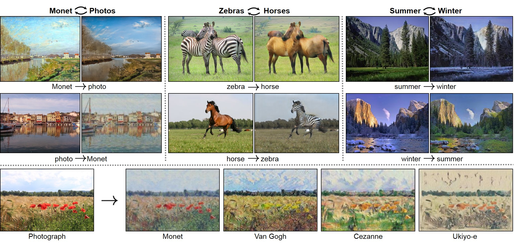
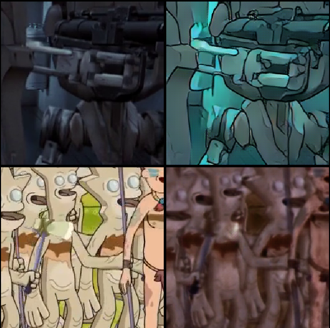
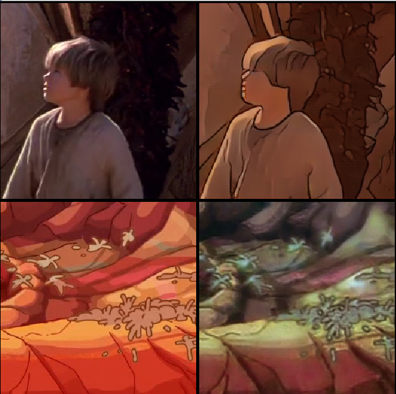

# Style Transfer between Star Wars and Rick and Morty

At some point in my life, I asked myself how would the amazing Rick and
Morty look like in real. All the nice artistic drawings of space monsters and
weird worlds, would probably be amazing input for a digital CG artist.
Sadly, I have zero animations or modeling skills so I had to take a different route to see this happen.

I recently learned about the [Cycle-GAN](https://junyanz.github.io/CycleGAN/),
an amazing technology that takes the style from
one domain for example zebras and transfers it to another domain horses. It works very well and
the authors provide many examples of transfers between different domains.



Looking at this amazing technology, I came up with an idea to use Rick and Morty as a domain and map it
to another domain of real images and what would fit better for a target domain than Star Wars. Lucky
the cycle GAN does not require complicated labeling of the training, instead, it just needs the data split
into two groups.

```bash
dataset
    ├── testA
    ├── testB
    ├── trainA
    └── trainB
```

## Data preparations

For the Cycle-GAN to work we needed a lot of images from the two domains, but we only have two videos.
Therefore, we use a few `ffmpeg` command to extract all the frames from the files.

```bash
    ffmpeg -ss 00:00 -i rickAndMorty.mp4 -t 30:00 frames/rickAndMorty%08d.png
    ffmpeg -ss 00:00 -i starwars.mp4 -t 2:30:00 frames/starwars%08d.png
```

This gives us a lot of data, roughly 200GB, since we lose the nice video compression and every frame needs
to store redundant information. Anyhow, for our use-case it is perfect.
Now we randomly pick 10.000 images as train data from each. This can be quickly done with the following command.

```bash
    ls starwars*.png | shuf -n 10000 | xargs -I {} mv {} trainA
    ls rickAndMorty*.png | shuf -n 10000 | xargs -I {} mv {} trainB
```

and that is already it all the other preprocessing is done by the Cycle-Gan.

## Training

To start the training we have to clone the [Cycle-GAN](https://junyanz.github.io/CycleGAN/) repo and move our dataset into
the datasets directory. One thing to mention is that the frames are both different size and rectangular, what is usually not
optimal for training machine learning systems. However, the training script provides an option to extract a random patch of size
256x256 for training. Additionally, they provide a small web app to track the progress of the training. We start by running the
small web app and then training the network.

```bash
    python -m visdom.server
    python train.py --dataroot ./datasets/starwarsrickandmorty --nam starrick_cycle_gan --model cycle_gan --preprocess crop --crop_size 256
```

This will start the training for 200 epochs using most of the default settings. After letting it run for a while we start to get nice looking results.

| Example after 37 epochs  | Example after 52 epochs  |
| :----------------------: | :----------------------: |
|  |  |

We can see that the style of Ricky and Morty is very nicely applied to Star Wars. However,
getting Rick and Morty in photo-realistic images is a way harder problem and therefore it does not look optional. In my option it is still funny.

## Testing

To test how the final result looks, we have to move all the frames to the test directory and run test command.

```bash
    python test.py --dataroot ./datasets/starwarsrickandmorty --nam starrick_cycle_gan --model cycle_gan --preprocess none --num_test 100000000000000
```

Now the only thing left to do is to merge the frames into a video.

```bash
    ffmpeg -framerate 24 -pattern_type glob -i 'starwars*_fake_A.png' -c:v libx264 -r 30 -pix_fmt yuv420p fake_A.mp4
```

As a final step, we have to extract the sound from the original files and add them to the newly created videos.

```bash
    ffmpeg -i rickAndMorty.mp4 -q:a 0 -map a rickAndMorty.mp3
    ffmpeg -i fake_A.mp4 -i rickAndMorty.mp3 -codec copy -shortest rickandmortyFinal.mp4
```

Done!

## Results

In this section, I quickly want to show some results.

### Results from Rick and Morty

|           Original            |           Fake           |
| :---------------------------: | :----------------------: |
|  |  |
|  |  |
|  |  |
|  |  |

I have to say, I was a bit disappointed with the results in this direction of the style transfer. However,
it was kind of expected since, creating something realistic from a comic is quite hard.
The dark style of Star Wars led to a darkening of every frame. In some case we can see some 3D effects coming up.
To get better results I guess some fine-tuning is required.
But I think it was still a funny project.

### Results from Star Wars

|           Original            |           Fake           |
| :---------------------------: | :----------------------: |
|  |  |
|  |  |
|  |  |
|  |  |
|  |  |
|  |  |
|  |  |
|  |  |
|  |  |
|  |  |

On the other hand, I really love the results of the Star Wars style transfer. I think the colourful essence of Rick and Morty
got very well transferred. Additionally, I was very surprised that were no temporal artifacts or borders of patches visible.
